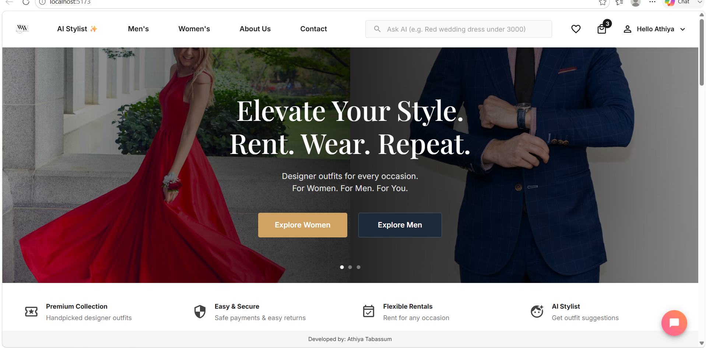
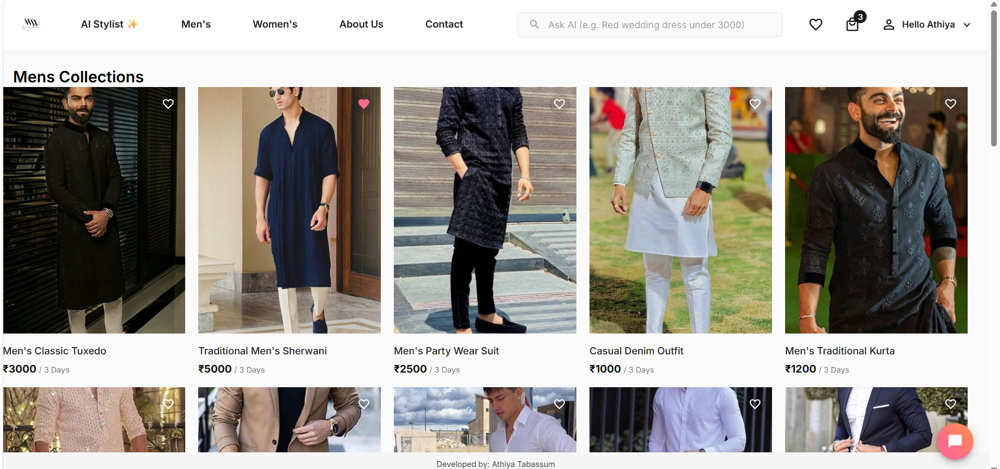
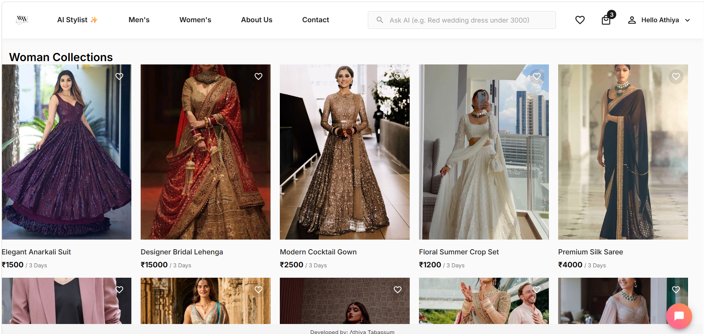

# 👗 AI-Powered Dress Rental & Fashion Recommendation Platform

A full-stack, AI-driven e-commerce platform that modernizes the dress rental experience. This project goes beyond basic CRUD operations by integrating advanced **Retrieval-Augmented Generation (RAG)**, **Semantic Vector Search**, and a **Conversational AI Stylist** directly into the user experience.

## ✨ Key Features

### 🛒 Core E-Commerce
- **MERN Architecture**: Built with MongoDB, Express, React, and Node.js.
- **Authentication**: Secure JWT-based user login and registration.
- **Shopping Flow**: Full cart, wishlist, and seamless checkout experience.
- **Admin Dashboard**: Manage inventory, view orders, and edit product details.
- **Amazon-style Product Pages**: Interactive image galleries, customer reviews, and dynamic delivery information.

### 🤖 AI Capabilities
- **AI Stylist & Chat Widget**: A persistent, globally available conversational AI that understands complex user queries (e.g., "I need a blue dress for a summer wedding under ₹3000") and injects structured product cards directly into the chat flow.
- **RAG & FAISS Semantic Search**: Replaced traditional keyword search with mathematical vector similarity. Users can search by natural language, and the AI retrieves contextually relevant items.
- **Personalized Homepage**: Dynamically updates based on your recent searches using FAISS retrieval, alongside "AI Picks of the Week" generated by Groq.
- **"You May Also Like"**: A true semantic similarity engine that finds visually and contextually similar dresses to the one you are currently viewing.
- **AI Admin Assistant**: Automates the painful process of writing product descriptions and extracting metadata tags using Groq LLM integration.

## 📸 Screenshots


*The stunning, dynamic homepage featuring modern e-commerce UI design and responsive layouts.*


*The Men's Collection page with seamless filtering, sorting, and quick "Add to Cart" and "Wishlist" actions.*


*The Women's Collection showcasing beautiful product grids, interactive hover effects, and full e-commerce capabilities.*


*Our custom Conversational AI Stylist that dynamically recommends products visually and understands complex natural language requests.*

## 🏗️ Architecture

```text
React Frontend (Vite, MUI)
        │
        ▼
Node.js API Gateway (Express)
        │
        ▼
FastAPI AI Service (Python)
   ├── Groq LLM (Llama/Mixtral)
   ├── FAISS Vector Search
   └── HuggingFace Embeddings
        │
        ▼
MongoDB Atlas (Database)
```

## 🛠️ Tech Stack
- **Frontend**: React.js, Vite, Material-UI, React Router, Axios.
- **Backend**: Node.js, Express.js, JWT, Mongoose.
- **AI Service**: Python, FastAPI, FAISS, Sentence-Transformers, Groq API.
- **Database**: MongoDB.

## 🚀 Installation & Local Setup

### 1. Clone the repository
```bash
git clone <your-repo-url>
cd DressR
```

### 2. Setup MongoDB & Node Backend
```bash
cd dress_rental_backend
npm install
```
Create a `.env` file in `dress_rental_backend`:
```env
PORT=4000
MONGODB_URI=your_mongo_connection_string
JWT_SECRET=your_jwt_secret
FASTAPI_URL=http://127.0.0.1:8001
```
Start the server:
```bash
npm start
```

### 3. Setup FastAPI AI Service
```bash
cd ../ai_service
python -m venv venv
source venv/bin/activate  # On Windows: venv\Scripts\activate
pip install -r requirements.txt
```
Create a `.env` file in `ai_service`:
```env
GROQ_API_KEY=your_groq_api_key
MODEL_NAME=mixtral-8x7b-32768
MONGO_URI=your_mongo_connection_string
```
Start the AI server:
```bash
python -m uvicorn app:app --port 8001
```

### 4. Setup React Frontend
```bash
cd ../dress_rental
npm install
```
Create a `.env` file in `dress_rental`:
```env
VITE_API_URL=http://localhost:4000
```
Start the frontend dev server:
```bash
npm run dev
```

## 📈 Future Enhancements
- Integrate a real payment gateway (Stripe/Razorpay).
- Add user-uploaded image search (Visual Search).
- Deploy to Vercel (Frontend), Render (Node & FastAPI), and Atlas (DB).
